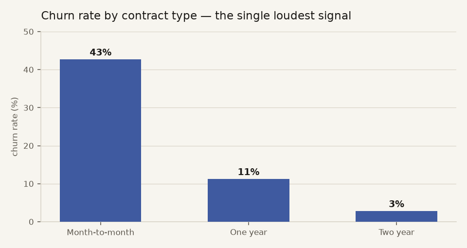
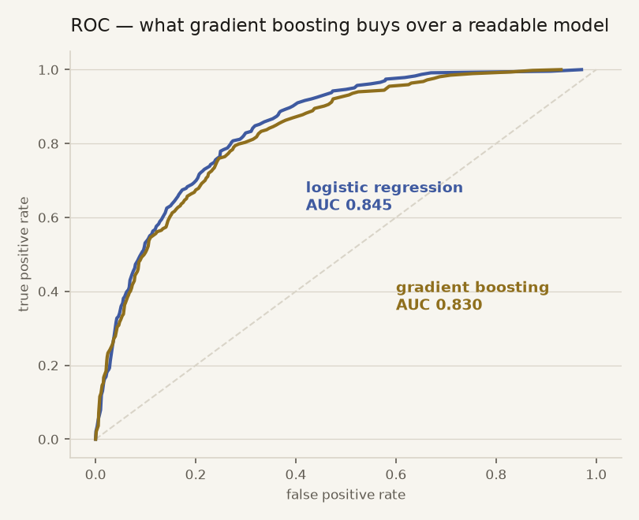
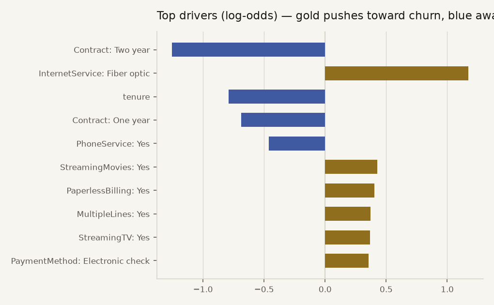

# Churn Radar — who's about to cancel, and why

Telco customer churn prediction on **real data**: the public IBM Telco
Customer Churn dataset, 7,043 actual customer records. The shipped model is
plain logistic regression — every prediction is a sum of coefficients you
can read — and the whole thing runs **in the browser**: sliders in, churn
probability and the exact per-feature reasoning out.

Live demo: [hnguyen.dev/churn](https://hnguyen.dev/churn/) · full write-up: [ANALYSIS.md](ANALYSIS.md)

The demo is a Power BI-style dashboard computed live from all 7,043 rows in
the browser: KPI band (including predicted monthly $ at risk), six
cross-filtering charts, Kaplan-Meier retention curves by contract, an
intervention simulator (threshold + offer economics → expected net, with
realized precision/recall against the actual labels), and a top-at-risk
customer table with per-customer model reasoning. The raw CSV, rows.json,
and model.json are all linked from the page — nothing is hidden.



## The headline finding

On this dataset, the readable model **wins**:

| model | ROC AUC | avg precision | Brier |
|---|---|---|---|
| logistic regression (shipped) | **0.845** | 0.635 | 0.137 |
| gradient boosting (benchmark) | 0.830 | 0.627 | 0.143 |

5-fold CV AUC for the logistic model: 0.843 ± 0.014 — the test split isn't
luck. With ~7k rows of mostly categorical features, gradient boosting has
nothing extra to find; it just memorizes noise the linear model refuses to.



## What drives churn here

Month-to-month contracts, fiber-optic internet, electronic-check payment,
and short tenure push risk up; two-year contracts and long tenure pull it
down hard. The chart is literally the model's coefficients:



## Honest handling of the data

- `TotalCharges` has 11 blank strings (brand-new customers) → coerced to 0.
- `TotalCharges` is then **dropped**: it's tenure × monthly charges in
  disguise (r > 0.99) — keeping it would double-count the same signal.
- One-hot encoding and standardization are explicit (`churn/train.py`), so
  every column maps 1:1 to a named coefficient — no pipeline magic.
- 25% stratified hold-out; metrics reported on data the model never saw.

## The in-browser demo

`churn train` exports `churn/ui/model.json`: preprocessing constants +
every coefficient. The page scores customers with 30 lines of JS
(`sigmoid(intercept + Σ coef·x)`) and shows each feature's signed
contribution — the actual model arithmetic, not a post-hoc explainer.
A test asserts the exported spec reproduces sklearn's probabilities to
within 5e-5 (`tests/test_churn.py`).

## Run it

```bash
pip install -e ".[dev]"
python -m churn train     # retrains, rewrites model.json + charts
python -m pytest          # 5 tests incl. sklearn↔spec parity
```

## Layout

```
churn/        data loading/cleaning, explicit feature matrix, training,
              chart generation, CLI
churn/ui/     the static demo (index.html + exported model.json)
data/         the IBM Telco dataset (public sample data, 7,043 rows)
assets/       report charts (regenerated by `churn train`)
tests/        pytest suite
```
