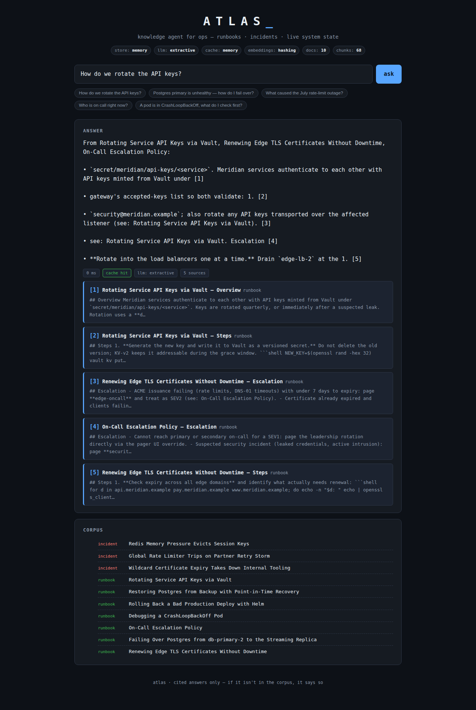
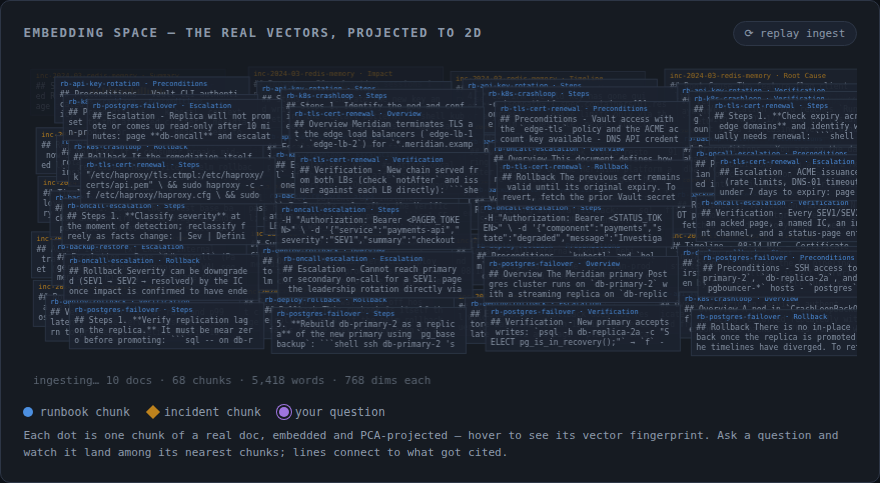
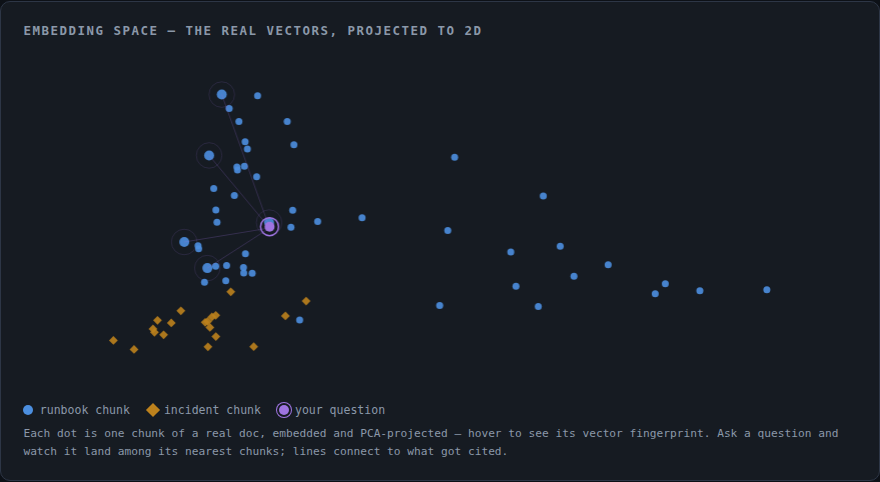

# Atlas — knowledge agent for ops

Ask *"how do we rotate the API keys?"* and Atlas answers from your runbooks,
past incidents, and live system state — **with citations** — instead of you
digging through a wiki at 2 a.m.



The UI also shows the **embedding space itself**. On page load you watch the
ingest happen: the panel floods with the raw corpus — actual runbook text,
front-matter, a counter ticking up to every ingested word — until it's
overwhelming, and then vectorization solves it: each block dissolves into its
embedding barcode and collapses into a clean 2D map (real 768-dim vectors,
PCA-projected server-side). Hover any dot for its vector fingerprint; ask a
question and it drops into the map, pulses its nearest chunks, and draws
lines to exactly what got cited. Retrieval, visible.





## How it works

```
            ┌────────────┐   chunks    ┌──────────────────┐
 corpus/ ──▶│  chunking   │──────────▶│  vector store     │
 (runbooks, │ (LangChain  │  + embeds  │  pgvector / mem   │
 incidents) │  splitters) │            └────────┬─────────┘
            └────────────┘                      │ top-k (hybrid:
                                                │ cosine + keywords
 ops/system-state.yaml ──────────────┐          │ + title boost,
 (versions, on-call, open alerts)    │          │ relevance floor)
                                     ▼          ▼
                              ┌─────────────────────────┐
 "how do we rotate     ────▶  │  LLM (Groq / extractive) │──▶ answer + [n]
  the API keys?"              │  cited sources only      │    citations
                              └────────────┬────────────┘
                                           │
                              Redis cache ◀┘  (hot queries answer in ~0 ms)
```

- **Retrieval**: sections are split on markdown headings (LangChain text
  splitters), embedded, and stored in **Postgres + pgvector**. Ranking is a
  hand-rolled hybrid — cosine similarity blended with keyword overlap and a
  document-title boost — behind a relevance floor, so an off-corpus question
  gets an honest *"I couldn't find anything"* instead of confident noise.
- **Generation**: **Groq** drafts the answer fast (via LangChain), under a
  system prompt that only allows claims cited `[n]` against the retrieved
  sources. Without an API key, a local extractive answerer stitches the most
  relevant sentences instead — retrieval quality is real, prose is basic.
- **Live state**: `ops/system-state.yaml` stands in for your status API /
  service registry — deployed versions, on-call, open alerts flow into the
  answer context (see `atlas/state.py` for the one-method interface).
- **Cache**: answers are cached in **Redis** keyed on the normalized
  question, so hot queries repeat instantly.

Every component is pluggable (`ATLAS_STORE`, `ATLAS_LLM`, `ATLAS_CACHE`,
`ATLAS_EMBEDDER`), which is what makes the two modes below possible.

## Run it — demo mode (zero setup, no keys)

```bash
pip install -e .
python -m atlas serve          # → http://localhost:8300
```

Run it from the repo root — the corpus and system-state paths default to
`corpus/` and `ops/system-state.yaml` relative to the working directory
(override with `ATLAS_CORPUS_DIR` / `ATLAS_STATE_FILE`).

In-memory store, local hashing embeddings, extractive answers. The UI is
two tabs: **THE DATA** — a file explorer over the raw corpus (CSVs render
as real spreadsheets, PDFs embed, diagrams show full-size) — and **ASK
ATLAS**, where the first visit plays the ingest sequence: everything you
just browsed vectorizes into the embedding map.

The sample corpus is 30 fictional-but-realistic Meridian platform docs
(~15.6k words) across four formats: 15 markdown docs (runbooks, incident
post-mortems, a war-room transcript), 5 PDFs parsed page by page, 5 CSVs
(including a 152-row alert history) ingested as column/row sections, and
5 diagrams (PNGs ingested through sidecar descriptions, shown as
thumbnails when cited — Atlas doesn't pretend to see pixels). Non-markdown
files carry their metadata in a `<file>.md` sidecar.

CLI works too:

```bash
python -m atlas ask "What caused the July rate limit outage?"
```

## Run it — full stack

```bash
cp .env.example .env           # add your GROQ_API_KEY
docker compose up --build      # → http://localhost:8300
```

That's pgvector + Redis + fastembed (bge-small) embeddings + Groq generation.

## Static demo — runs entirely in the browser

```bash
python -m atlas export --out dist   # exports corpus/ + corpus-supply/
python -m atlas export --out dist --corpus "My Team=path/to/docs"   # your own
```

The export ships every corpus as a switchable dataset — the live demo has
two: **Meridian Platform Ops** (SRE/platform) and **Cascadia Distribution
Co.** (supply chain), proving the same pipeline works on any domain. Each
dataset carries its own sample questions (`samples.yaml`) and live state
(`system-state.yaml`) inside its corpus directory.

Bakes the demo into a self-contained site (~460 KB): the real chunk
embeddings (int8-quantized), the PCA basis, and a JS port of the same
hashing embedder + hybrid ranker + extractive answerer (`atlas/ui/engine.js`,
kept hash-identical to `atlas/embeddings.py`). Visitors ask questions and
retrieval runs in their browser — no server, no keys. This powers the live
demo at [hnguyen.dev/atlas](https://hnguyen.dev/atlas/).

## API

| Route | What |
|---|---|
| `POST /api/ask` | `{question, k?}` → answer, citations, latency, cache status |
| `GET /api/docs` | corpus listing |
| `GET /api/map` | every chunk PCA-projected to 2D + 24-bin vector fingerprints |
| `GET /api/state` | current system state |
| `GET /api/health` | component modes + index counts |
| `POST /api/reindex` | re-ingest the corpus |

## Tests

```bash
pip install -e ".[dev]"
python -m pytest               # fully offline: chunking, retrieval, cache, state, API contract
```

## Layout

```
atlas/          the package — config, corpus, chunking, embeddings,
                store, cache, llm, state, pipeline, api, cli
atlas/ui/       the single-page web UI (ships with the package)
corpus/         sample runbooks + incident post-mortems (front-matter + md)
ops/            system-state.yaml (the "live state" source)
tests/          pytest suite (runs fully offline)
```
